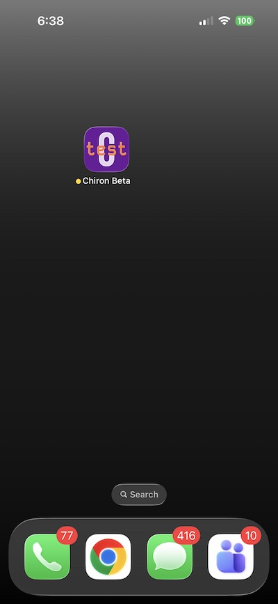
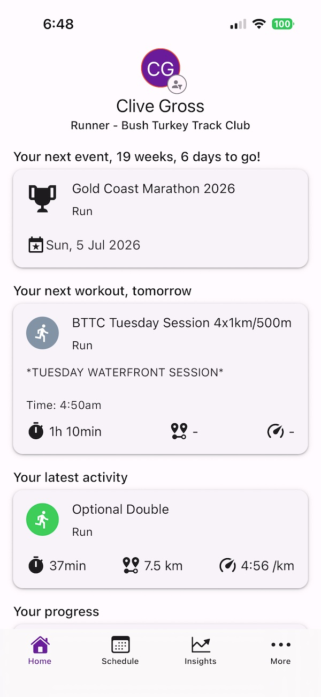

After months of building and refining Chiron, I’m excited to share:

**Chiron has officially been deployed to TestFlight.**

This is a major milestone. It means Chiron is no longer just a prototype — it’s now a real iOS app that can be installed, tested, and evaluated in the wild.

It’s not publicly available yet but the foundation is now in place.

## What Is TestFlight?

[TestFlight](https://apps.apple.com/app/testflight/id899247664) is Apple’s official beta testing platform.

It allows developers to distribute pre-release versions of iOS apps to real users before they’re publicly available on the App Store. Testers install the app through TestFlight, instead of the usual App Store, use it like any normal app, and can provide feedback directly.

And that’s where the next phase begins.

## What’s Been Happening Behind the Scenes

Getting to TestFlight wasn’t just about packaging an app.

Over the past few weeks, I’ve been cleaning up and stabilising core functionality — especially around two fundamental concepts in Chiron:

- Workouts
- Events

These are the backbone of the platform. The next phase of work focuses on strengthening both.

## Merged Workout Support

Support for merged or stitched activities is currently being added to `chironpy`, the open-source sports analysis library that powers Chiron’s activity data processing. If you missed the backstory, check out [Open Source is Endurance Too: Introducing chironpy](/blog/open-source-is-endurance-too-introducing-chironpy/).

If you’ve ever:

- Recorded a warm up and main set separately
- Had your watch split a session into multiple files

You know how messy that can get.

The upcoming update will:

- Reconcile overlapping timestamps
- Maintain clean 1Hz continuity
- Declutter athletes training schedules

It’s a small feature on the surface — but foundational for data integrity and trustworthy training insights.

## Events: The Bigger Picture

The coming weeks are also focused heavily on events.

Chiron isn’t just a workout tracker. It’s built around preparing for something - a race, a goal, a target date.

Upcoming work includes:

- Stronger linking between workouts and events
- Refining how readiness trends toward race day goals
- Making event context central to the training experience

Training only makes sense relative to a goal.

## What Happens Next

Over the coming weeks:

- Merged workout handling will land in `chironpy` and support added to Chiron shortly after
- Event workflows will be tightened
- UI refinements will continue
- Security and stability validation
- Expanded internal testing

Once the experience is ready for real-world use, I’ll begin onboarding a small group of early iPhone users in March 2026.

If you’re interested in being part of that group, feel free to reach out.

This is the beginning of the real phase. More updates soon.

— Clive
Founder, Chiron

**Be the first to know about Chiron's release - [Sign up here](/contact/).**
