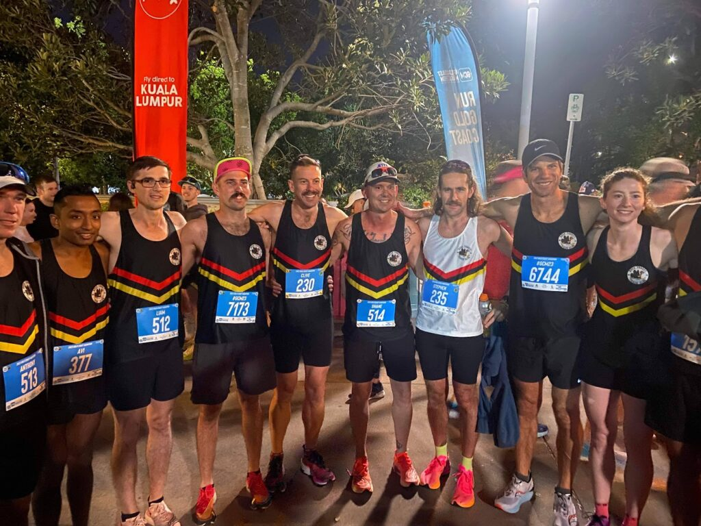
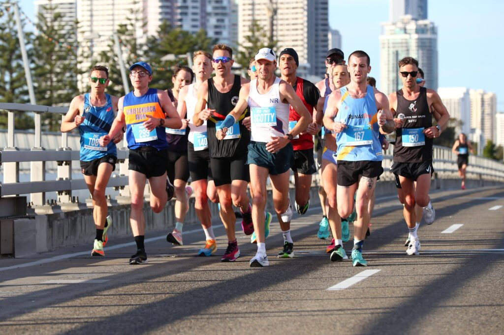
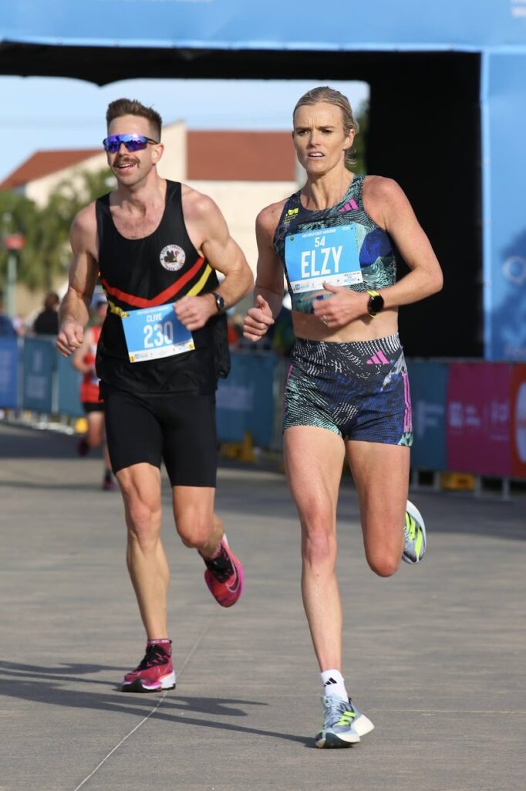
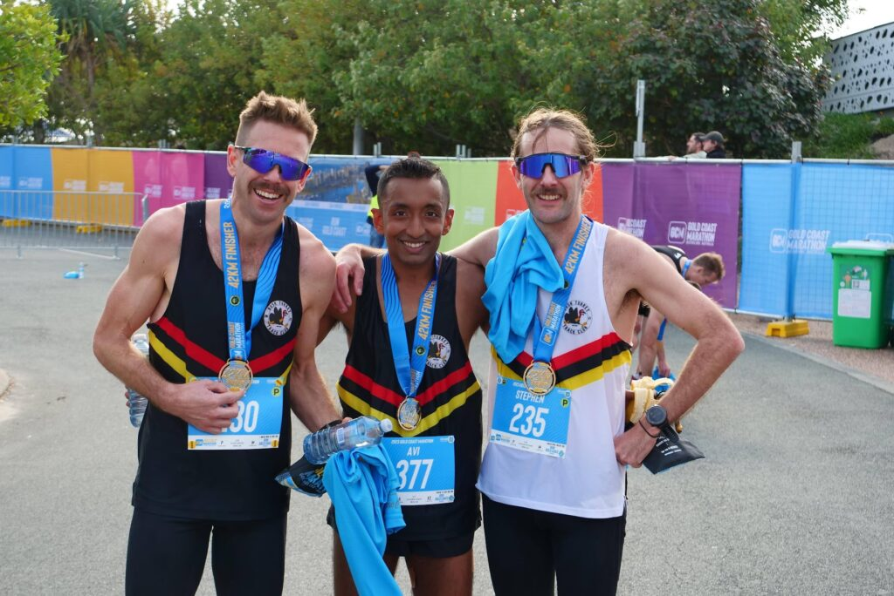

On 2nd July, 2023, I stood at the starting line of the [Gold Coast Marathon](https://goldcoastmarathon.com.au/), determined to surpass my previous best. Months of rigorous training and the memory of my 2:37 [marathon in Melbourne](https://melbournemarathon.com.au/) last October fueled my hunger for improvement. My victory at the [Gold Coast Running Festival Half Marathon](https://www.theeventcrew.com.au/event/gold-coast-running-festival/) in April compelled me to set an ambitious goal of completing the marathon in under 2:30.

Loaded with 15% more carbs than my previous marathon, I was ready to push my limits. The presence of Olympian [Genevieve Gregson](https://www.instagram.com/gengen_lacaze/), making her marathon debut with a target time of 2:28-2:30, supported by pacers added to the excitement. I aimed to run with this pack.

During the initial 3km, I gradually closed the gap to the Gen Gregson pack, maintaining a steady pace of around 3:30-31/km. Running in a large group of about 20. I felt great and chatted to several of the other runners around.

Around the 15km mark, I moved to the front of the pack and found myself conversing with lead pacer, [Scotty Westcott](https://www.instagram.com/scottwestcott1/), an Olympian and elite distance running coach. Sensing my extreme enthusiasm, Scotty advised me to dial back my intensity. I imagine he perceived me as an excited puppy, clipping his heels, while yelling out and high fiving mates heading the opposite direction. Grateful for his guidance, I followed his consistent pacing, maintaining perfect 5km splits of 17:30-40/km.

At around 25km, fatigue began to seep in. While not struggling, the effort felt harder than during my previous marathon. At 31km, our pack overtook Olympian [Eloise Wellings](https://www.instagram.com/elzywellings/) and her pacers, who seemed to be struggling.

At the 33km mark, one runner broke away from the pack. Impulsively, I decided to join the breakaway, sensing a slight deceleration among the remaining runners. Unfortunately, this decision was ill-fated as I encountered the infamous wall—a new experience for me.

After the northern turnaround, I battled against a headwind in the final stretch. my legs slowed down, my vision blurred, and my mind descended into darkness. Cramps in my left hamstring, followed by the right, made the struggle unbearable and I attempted to walk off the cramps for 20m. I helplessly watched Gen's pack sail past me, unable to match their speed. I was overtaken by other runners every minute. Disorientation set in and I feared collapsing before reaching the finish line. Entering the finishing chute, I spotted Ewan and friends on the sidelines, mustering a smile and exchanging high fives. It was then that Eloise Wellings zoomed past, and I limped behind her across the finish line.

Despite the challenging final kilometres, I was pleasantly surprised to learn that I finished with a time of 2:31:50, given the minutes lost during the last 7km felt like eternity. I am immensely grateful for the support I received from my family, friends, club members, and strangers along the course, even if I couldn't express it during the gruelling home stretch.

In hindsight, sticking with Gen’s pack (who finished with an impressive time of 2:28) may have allowed me to delay hitting the wall and achieve my sub-2:30 goal. While I executed my fueling plan flawlessly, consuming over 80g of carbs per hour, I realised that prioritising hydration more effectively perhaps could have prevented the cramps and extreme fatigue.

In terms of training, I believe I nailed the marathon build. Despite falling short of my goal, I attribute it to race day decisions rather than flaws in my preparation. Carving nearly 6 minutes off my previous marathon time within just 9 months brought me satisfaction. Training alongside my mates and bringing it all together on race day was a rewarding experience. We will reflect on our performance, identify areas of improvement, and put it into practice.

Ultimately, the Gold Coast Marathon tested my resilience and taught me valuable lessons. It reinforced the significance of support from those around me and the knowledge I gained along the way. I look forward to my next marathon, armed with the unforgettable experiences and the determination to continue improving.
