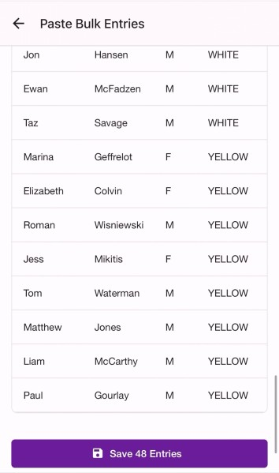
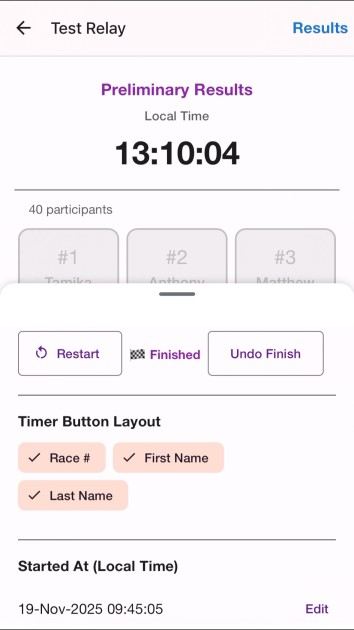
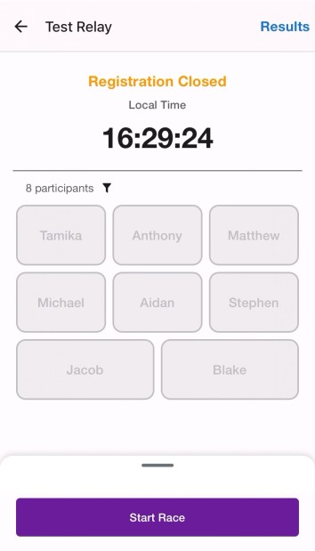
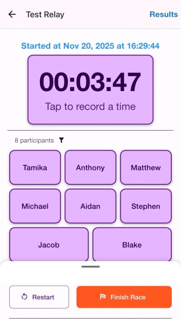
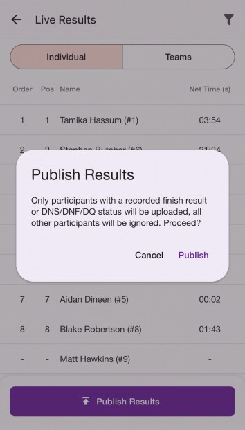
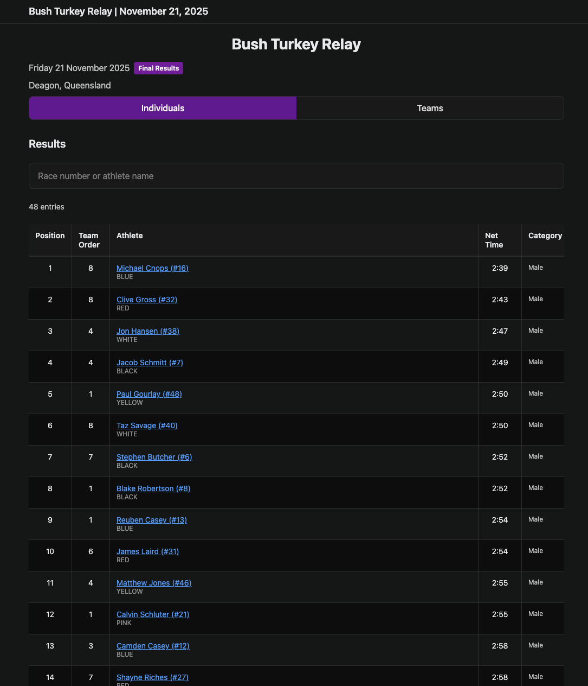
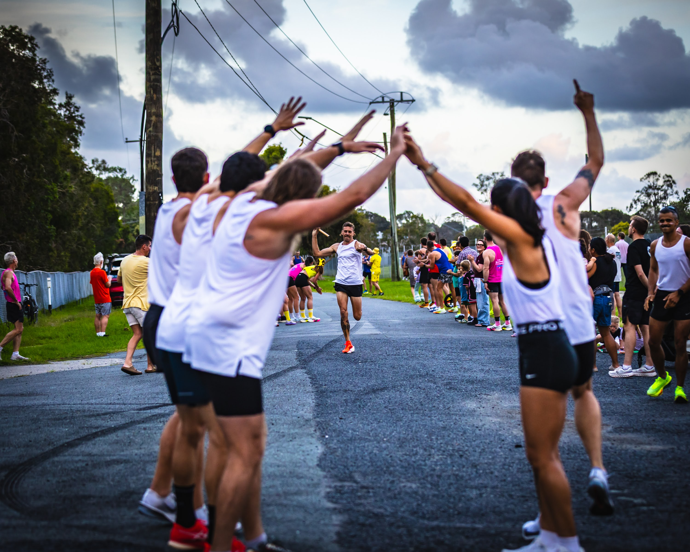
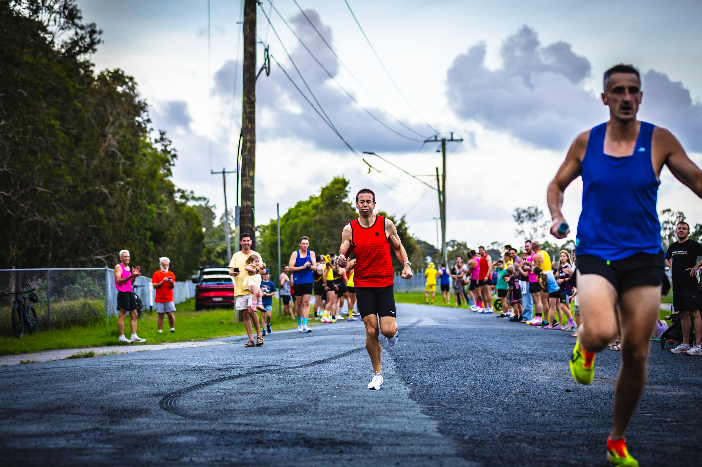
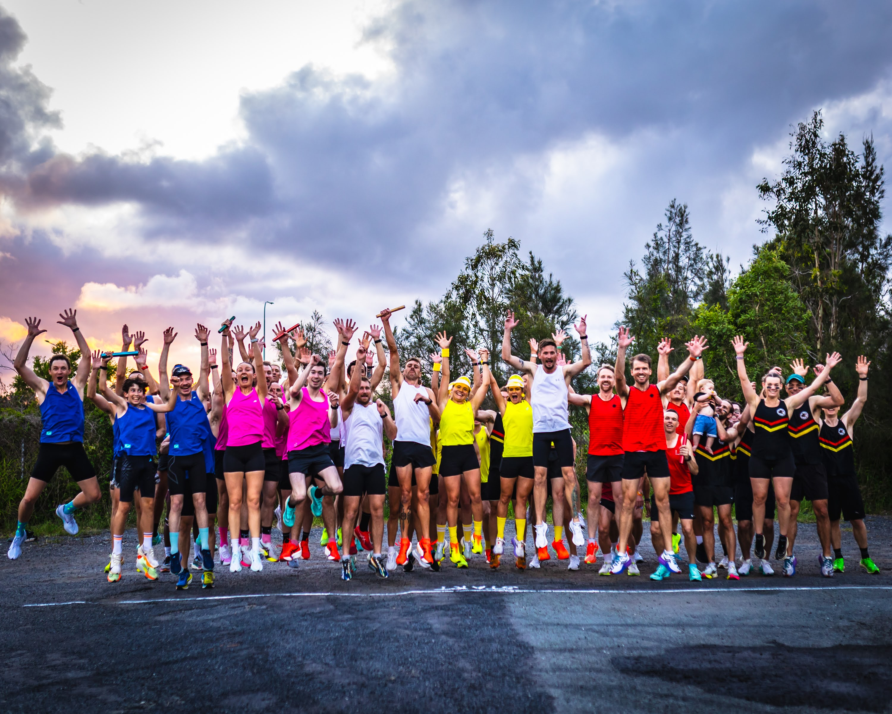

<figcaption>

_Photo by [Paul Manning](https://www.instagram.com/thesundaylongrun/) 2025._

</figcaption>

Excitement was high at this year’s **Bush Turkey Relay**! The club expanded from 4 teams of 8 to 6 teams of 8 (48 participants), introducing **two new team colours: blue and pink**. I once again anchored the **red team**, captained by James for the fourth consecutive year.

The relay was fast, competitive, and tremendous fun. With more teams than ever, the atmosphere was buzzing from start to finish. Despite the chaos that often comes with managing spreadsheets, start lists, and publishing results, the event ran smoothly — thanks in large part to the debut of the **new race timing system in Chiron**.

---

## Why We Built the Race Timing System

As the club’s tech lead, I usually handle:

- Website updates
- Start lists
- Results publishing

While I enjoy it, importing/exporting data from spreadsheets and posting results from my phone during the after-party is **time-consuming** and can take away from the experience.

The **Chiron Race Timing System** was built to **simplify and partially automate race organisation**, letting everyone enjoy the event while keeping things accurate and professional.

---

## How the System Works

The system streamlines every step of race day:

### Start Lists

Easily import teams and runners from spreadsheets or input manually.

### Timing

Supports both **manual timing** and **RFID chip timing (coming soon)** for accurate splits.

At the Bush Turkey Relay, **6 spectators, Linda, Andrea, Shane, Chris, Avi, and Mitch, volunteered to timekeep using the mobile web version of Chiron**, showing how easy it is for anyone to contribute.

<figcaption>

_Adjusting the race timing screen layout for a single relay team on mobile web._

</figcaption>

  

<figcaption>

_Race timing screen on mobile web, ready to  start._

</figcaption>

<figcaption>

_Race timing in progress, on mobile web._

</figcaption>

### Team Management

Add or modify teams and team members on the fly — perfect for events with growing participation.

### Manual Editing of Results

Mistakes happen! Any timing or data entry errors can be quickly fixed or reversed without stress.

### Results Publishing

Automatically publishes results to the [website](https://events.chironapp.com/), eliminating double data entry.

Check out the [official race results here](https://events.chironapp.com/events/7529ee32-fa91-410b-8c78-bc3d7299c789).

By automating these tasks and allowing race organisers and volunteers to contribute easily, we spend less time on admin and more time enjoying the event with the athletes.

---

## Event Highlights & Feedback

The Bush Turkey Relay was a **perfect first test** for the system. There were a few minor manual timing errors, but the system is designed such that they were easily corrected these before the results were finalised.

Huge thanks to **Linda, Andrea, Shane, Chris, Avi, and Mitch** for volunteering their time to timekeep and for trialling the race timing feature in a real live event. Seeing all six teams racing, with accurate timing handled by volunteers on mobile devices, and results published automatically, was incredibly rewarding.

## How Did the Race Go?

**White Team took the win for the second year in a row**! I put my heart and soul into the final leg, desperately trying to chase down Taz. I managed to pass Aidan and Isaac from the Black and Pink teams respectively in the first 500m.

However, it turns out I put a bit too much soul into it — my legs went lactic and I got the **death wobbles** with 200m to go, just in time for **Michael Cnops from the Blue team** to come tearing past in the final 20m, leaving me to finish **third**.

---

## What’s Next

This debut is just the start. Our goal is to make every race day:

- **Smoother**
- **Faster**
- **More fun**

for both participants and organisers. If you're interested in using Chiron to organise or time your next event, [**get in touch**](/contact/), we'd love to help.

