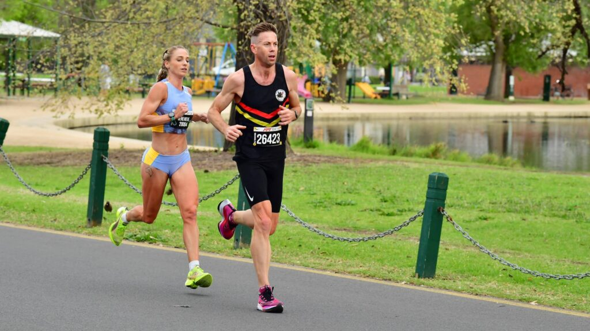
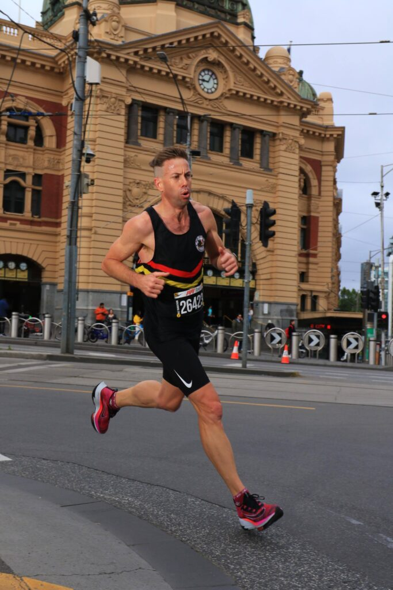

I love to set wildly ambitious running goals and work relentlessly toward achieving them. Following the mixed emotions of my Gold Coast Marathon experience, I set my sights on the Melbourne half marathon and breaking the 70 minute barrier. To accomplish this, I wrote PROJECT69, a 12-week program that focused on conditioning my body and mind for the 21.1km journey through Melbourne at 3:17/km pace.

The training program marked a pivot from my previous marathon block. It honed in on shorter and faster long runs, included more frequent threshold runs, and upped the weights and plyometrics. On average, I was covering about 118 km per week in my quest for 69.

As race day drew near, my confidence in my training grew, and the idea of achieving the 69-minute goal began to seem within reach.

On race weekend, I flew down with mates Anthony, Aidan, Liam and Mark, also running the half marathon, later catching up with Mat taking on the marathon.

Race morning found me at the second row from the start line. With the sound of the gun, I cruised up the initial hill and settled into my target pace, the elite men disappearing in front of me. I pulled alongside Gen Gregson and another runner, we chatted briefly and the three of us agreed to run together in pursuit of our shared sub-70 goal.

My goal was to hit 16:30 5km splits. The first 5km was slightly faster. Shortly after entering Albert Park, the runner by my side suddenly dropped back and disappeared, it was just me out in front with Gen tucked behind me. We went through 10km a tad slower than planned, but my confidence remained unshaken.

After battling against a headwind and navigating through the marathon tailwalkers in Albert Park, I started to feel the toll as the 15km mark approached. Gen gradually fell behind, leaving me solo with a moment of self-doubt. Thoughts of “maybe today isn’t the day for sub 70” and “perhaps I should just settle for a personal best” briefly crossed my mind. But I snapped out of it, focusing on the goal, and drawing inspiration from my family and friends supporting back home, particularly my son Hector’s recent parkrun achievement, running through discomfort to achieve his 24 minute goal.

Approaching the climb toward the Botanic Gardens, I reminded myself that conquering this final hill meant the hardest was behind me, and a smooth descent awaited, leading me back to the MCG. As I turned towards the stadium, my confidence grew. At this point I was hurting, but maintained control for the final kilometres and was able to dial up the intensity a little.

I glanced at my watch for the last time as I entered the stadium, it ticked over to 1:09:00.  I looked at the ¾ lap of the field remaining to the finish and was uncertain of the distance remaining but knew it would be close, so I punched it as hard as I could. I crossed the finish line with a gun time of 1:09:45, securing 10th place.

I was real happy with the result, and even more wrapped as the other lads came through, also with fantastic performances.
