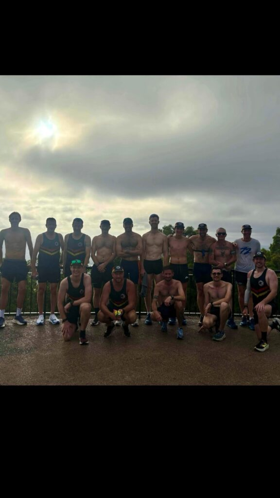

**Big miles, Christmas balance, and Chiron planning sessions**

_Week 10 of my Road to Osaka 2025 series focused on ramping up training volume while enjoying quality time with family during Christmas week._

The highlight for Chiron was a productive code party with my friend [James Harvey](https://www.linkedin.com/in/james-harvey-brisbane/). While no new features shipped this week, we made significant progress in refining the app’s direction and laying the groundwork for exciting updates in the new year.

Training-wise, it was a big volume, low-intensity week, capped off with the annual Bush Turkey Track Club Mt Coot-tha long run. A massive 30km run with over 800m of elevation gain was the perfect way to close out the week.

Total mileage for the week: 125km.

Catch the full recap in this week’s episode on Instagram: [@clivegross1](https://www.instagram.com/clivegross1/saved/road-to-osaka-2025/17967922253825997/)

_Week 10 of 18. Osaka Marathon 24 February 2025._
