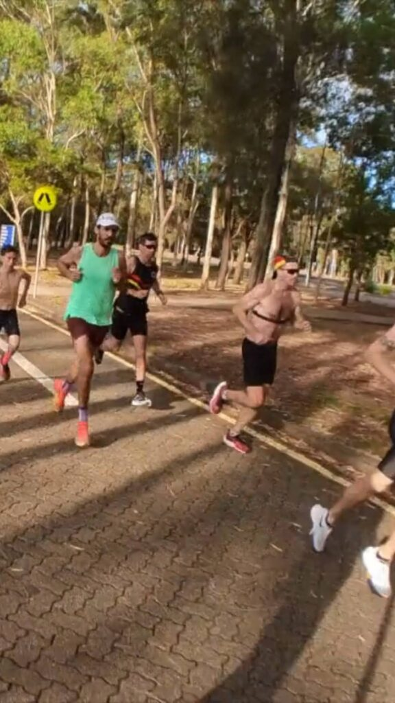

**Adapting and thriving in marathon prep**

Week 11 of my _Road to Osaka 2025_ journey was a mix of highs, challenges, and adaptability.

I kicked things off with another appearance [on the _Local Legends in Running_ podcast with Oli and Kyle](/2024/12/local-legends-in-running-podcast-s3-ep-70-road-to-osaka-gross-weise/). These discussions are always a great way to reflect on training and share insights, and this one didn’t disappoint!

On the Chiron front, I focused on refining the app’s inner workings. No flashy new features this week, but these updates tackled long-standing bugs and set the stage for exciting developments to come.

Training-wise, the highlight was Sunday’s 36km marathon workout, though it came with its share of hiccups. Mid-session, we were asked to leave the carpark where we were running, which forced us to adapt the plan on the fly. Once things settled, the session turned into a great collaborative effort with mates jumping in to pace, support on bikes, and even managing drink stations.

It’s weeks like this that remind me of the importance of flexibility in marathon training.

Total mileage for the week: 128km.

Catch the full recap in this week’s episode on Instagram: [@clivegross1](https://www.instagram.com/reel/DEih_IfT7BFVewWoCvJnYOvICiLb9CEORXF62w0/?igsh=YmZpdWNtMzV0eHEz)

_Week 11 of 18. Osaka Marathon 24 February 2025._
