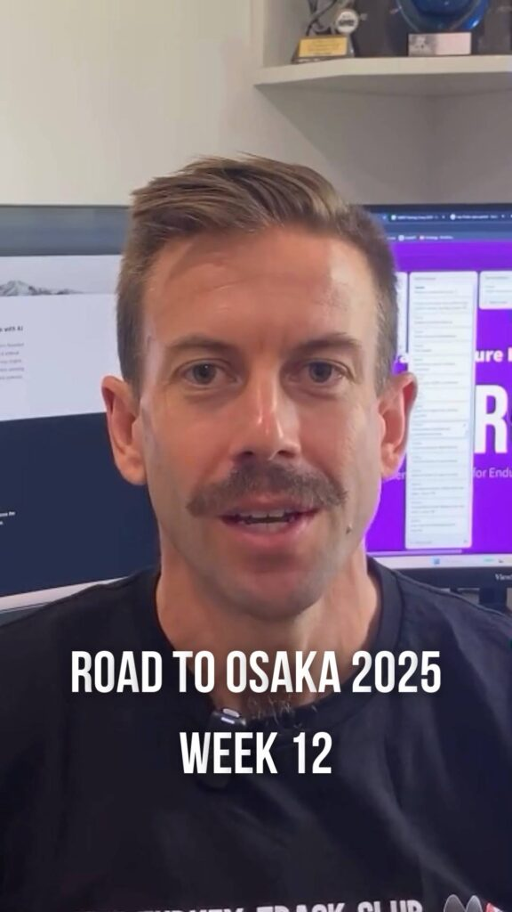
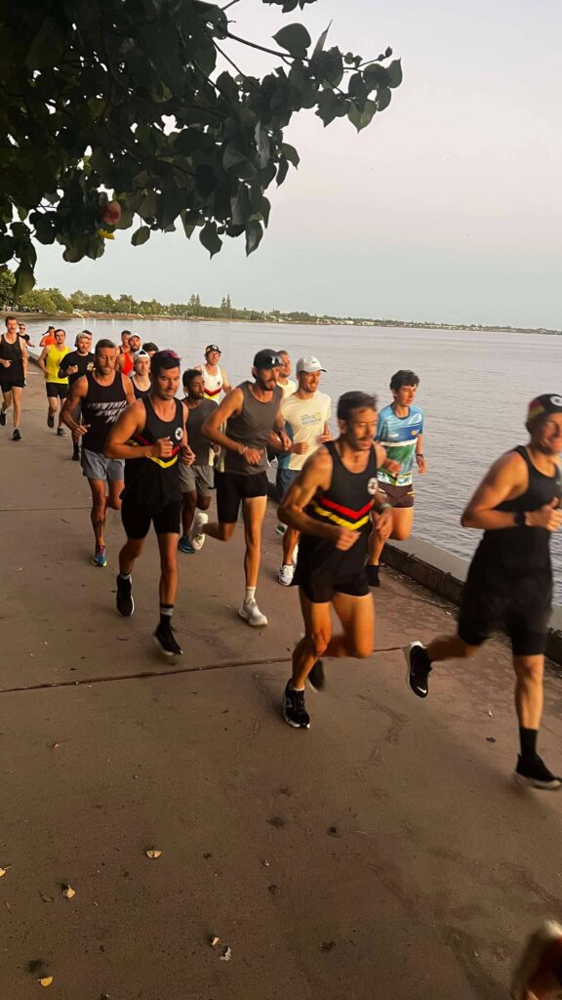

**Recover, refocus, and recharge: The Road to Osaka continues!**

Week 12 of my _Road to Osaka 2025_ was all about recovery and consolidation as I gear up for the final few weeks of hard training before tapering. Balancing work, training, and family commitments post-Christmas made this the perfect time to step back, let the body recover, and build momentum for the stretch ahead.

On the **Chiron** front, I continued refining the codebase, squashed a few lingering bugs, and made some small but meaningful updates to the Home Screen. I also hit a personal milestone by publishing my first training article, [**Managing Training Load for Long-Distance Runners**](/2025/01/managing-training-load-for-long-distance-runners/). It’s the first in a series of articles I’ll be sharing as we approach Chiron’s launch this year.

I also had the chance to join Oli and Kyle [on the _Local Legends in Running_ podcast](https://open.spotify.com/episode/44r2NYAxZbmzT8In60bSaK?si=5fDMgT8GRZe1ybFCvh-OZA). We talked about the last couple of weeks, marathon prep, and the mental side of training—definitely worth a listen if you’re interested in the journey.

Training-wise, the focus was on **deloading and recovery**. I reduced my volume and skipped some usual sessions, like the midweek long run, to allow the body to recharge. Highlights included an easy long run of 37km with the Bush Turkey crew and a solid 6x1km session on Tuesday, where I felt sharp and fit despite tired legs.

Total mileage for the week: 105km.

Catch the full recap in this week’s episode on Instagram: [@clivegross1](https://www.instagram.com/reel/DEzHJyfxq50VGgGLVWirEJO0tNtD6WpoAbwKpA0/?igsh=MXZqNXZxcWhqOWIweQ==)

_Week 12 of 18. Osaka Marathon 24 February 2025._

**Stay updated on Chiron's journey to release and be the first to know about new stories like this - [Sign up here](/contact/).**
