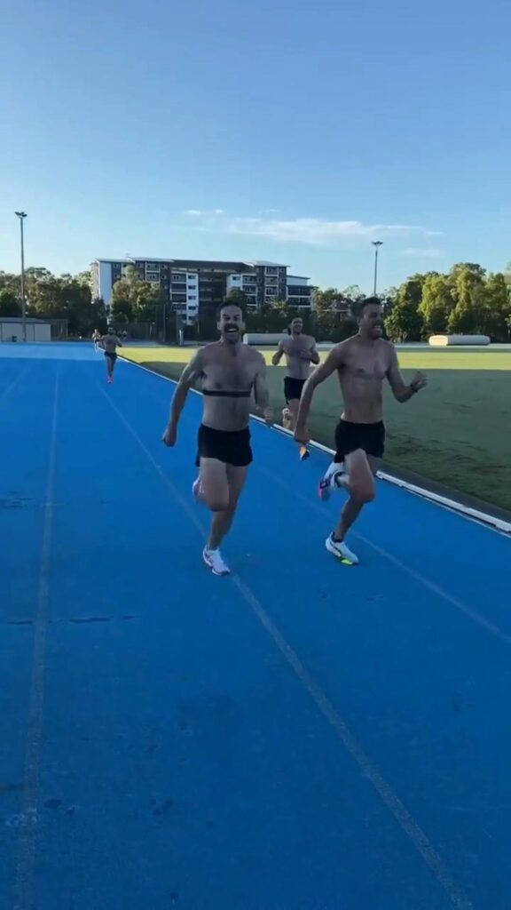

This week, I’ve hit a big milestone in my training—and I’m excited to share both my progress and a cool feature in **Chiron**.

🎥 **Catch the full Week 13 recap on [my latest reel](https://www.instagram.com/reel/DFFK4r6x-HD4zNJJeDljQ_HtA-x720suoqOO040/)!**

---

In the video, I preview Chiron’s **schedule recurring workouts feature**. For anyone with a regular training routine—like a Monday recovery run, a weekly gym session, or anything in between—you can now schedule workouts to repeat for up to **90 days in advance**. It’s a game-changer for saving time and keeping consistency! I’m already using it to lock in my recovery runs and gym sessions between now and race day.

---

As for training, this week has been my **biggest since June 2023**—clocking 133km and capped off with a solid **marathon-specific workout** on Sunday. Highlights include:

- **Tuesday's Bush Turkey track session** featuring a “last rep hero” race with Taz that came down to a photo finish (advantage: chest hair).

- **Sunday’s 3x7km marathon effort** with a great crew including [Kyle](https://www.instagram.com/kyle_weise/), Riine, and Marty—all prepping for Osaka too. Despite the fierce headwinds, we got it done, and it was a great confidence boost.

---

With just five weeks to go, things are heating up—literally and figuratively. Check out the reel for all the details, and don’t forget to sign up for updates on Chiron at **[www.chironapp.com](/contact/)**.

Let’s keep the momentum rolling. See you next week!

Total mileage for the week: 133km.

Catch the full recap in this week’s episode on Instagram: [@clivegross1](https://www.instagram.com/reel/DFFK4r6x-HD4zNJJeDljQ_HtA-x720suoqOO040/)

_Week 13 of 18. Osaka Marathon 24 February 2025._

**Stay updated on Chiron's journey to release and be the first to know about new stories like this - [Sign up here](/contact/).**
