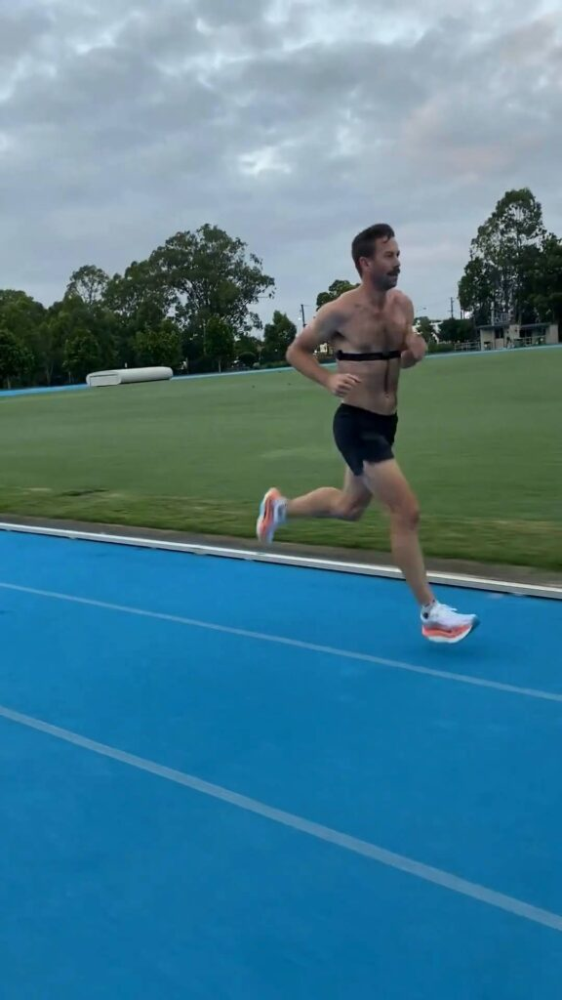

Peak mileage

Four weeks to go until [Osaka Marathon 2025](https://www.osaka-marathon.com/2025/en/), and this was my biggest training week in terms of volume—137km total, packed with quality training including a 39km long run.

This week, I also introduced a new feature in **Chiron: Event Attachments**. You can now upload race registrations, course maps, race plans, and even motivational images to keep everything in one place. I’ve already added all my key race details for Osaka—one less thing to worry about as race day approaches.

The peak is now done—time to start the taper.

🎥 **Catch the full week 14 recap on [my latest reel](https://www.instagram.com/p/DFZz8nYxeqp7nnThCIZw1mEurSB9KHYTkS-7bY0/)!**

---

---

_Week 14 of 18. Osaka Marathon 24 February 2025._

**Stay updated on Chiron's journey to release and be the first to know about new stories like this - [Sign up here](/contact/).**
