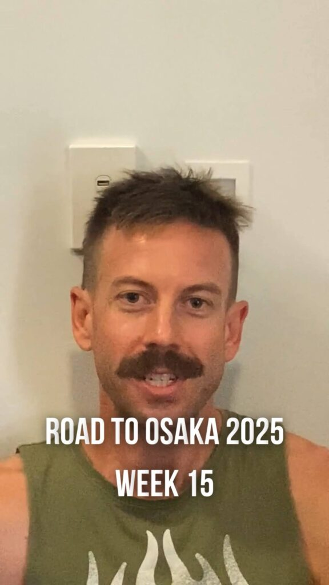
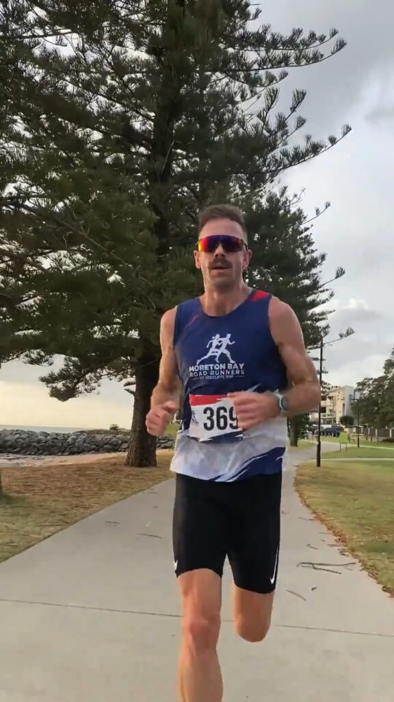

Three weeks to go until **Osaka Marathon 2025**, and this week was a battle.

🎥 **Catch the full Week 15 recap on [my latest](https://www.instagram.com/reel/DFFK4r6x-HD4zNJJeDljQ_HtA-x720suoqOO040/) [reel](https://www.instagram.com/p/DFzT2iYxbqdgHAyC9Il73sfxc6DuJgHQebbnck0/)!**

---

Between **peak marathon training, high work demands, home projects**, and everything else life is throwing at me, I’ve been running on fumes. A few days late on releasing this week's episode but—**we’re still getting it done.**

With so much on my plate, I didn’t have time to roll out a new Chiron feature this week, but I did do a **user experience audit** with my mate and UX expert, **Lee Hubbard**. It gave me some great insights on how to make the app smoother and more intuitive for athletes when it launches later this year.

The big effort this week was **Sunday’s [Moreton Bay Road Runners](https://www.mbrr.com.au/) 10km Time Trial**. I was hoping to run a PB, but with **a stiff headwind for the last 4km**, I had to dig deep just to hold pace. I crossed the line **14 seconds off my best**, but considering the conditions and marathon training fatigue, I’m **really happy with the result**. It’s another **confidence boost heading into taper.**

Total mileage this week: 114km. The hardest training is behind me. Now it’s time to **sharpen up and freshen up** for race day.

---

Check out the reel for all the details, and don’t forget to sign up for updates on Chiron at **[www.chironapp.com](/contact/)**.

Catch the full recap in this week’s episode on Instagram: [@](https://www.instagram.com/reel/DFFK4r6x-HD4zNJJeDljQ_HtA-x720suoqOO040/)[clivegross1](https://www.instagram.com/p/DFzT2iYxbqdgHAyC9Il73sfxc6DuJgHQebbnck0/)

_Week 15 of 18. Osaka Marathon 24 February 2025._

**Stay updated on Chiron's journey to release and be the first to know about new stories like this - [Sign up here](/contact/).**
