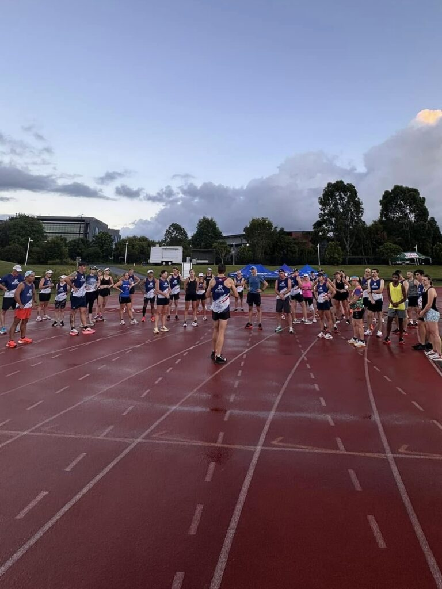

**The taper begins**

With just **two weeks to go until race day**, the biggest training weeks are behind me, and the **taper has officially begun**. Mileage is coming down, but **the fatigue is still lingering**—a reminder of the hard work that’s gone in.

---

This week still featured **some solid marathon-focused sessions**, including a **14km marathon effort on Friday** and a **mid-week 2-hour long run** to keep the endurance ticking over. But the real highlight was the **[Moreton Bay Road Runners](https://www.mbrr.com.au/) Club Camp** at Alexandra Headland.

The weekend kicked off with a **Friday night podcast interview** on **[Eat Sleep Run Repeat](https://open.spotify.com/show/3V6eJjtjbmlk14AOuHQewt?si=e712bd60dfaf4b8a)** with **[Guy Schweitzer](https://www.instagram.com/guys_home_run/)**, then on **Saturday morning, I led the club track session**. The rest of the day was packed with **great workshops from Paul Gourlay ([RunCo](https://www.runco.com.au/)), Christy, and Marty**, before wrapping up the weekend with a **Sunday long run** alongside **Avi and Liam**, followed by an **awesome guest talk from [Tim Vincent](https://www.instagram.com/timvincent_/)**.

Total mileage this week: 123km.

Now, these final two weeks are all about **freshening up, staying sharp, and arriving at the start line ready to race**. **Osaka is almost here!**

🎥 **Catch the full Week 16 recap on [my latest](https://www.instagram.com/reel/DFFK4r6x-HD4zNJJeDljQ_HtA-x720suoqOO040/) [reel](https://www.instagram.com/p/DFzT2iYxbqdgHAyC9Il73sfxc6DuJgHQebbnck0/)!**

---

Check out the reel for all the details, and don’t forget to sign up for updates on Chiron at **[www.chironapp.com](/contact/)**.

Catch the full recap in this week’s episode on Instagram: [@](https://www.instagram.com/reel/DFFK4r6x-HD4zNJJeDljQ_HtA-x720suoqOO040/)[clivegross1](https://www.instagram.com/reel/DF85IqGz1zB5-0F2FNVAPlc4z5Ut7-CGfA_K2M0/)

_Week 16 of 18. Osaka Marathon 24 February 2025._

**Stay updated on Chiron's journey to release and be the first to know about new stories like this - [Sign up here](/contact/).**

