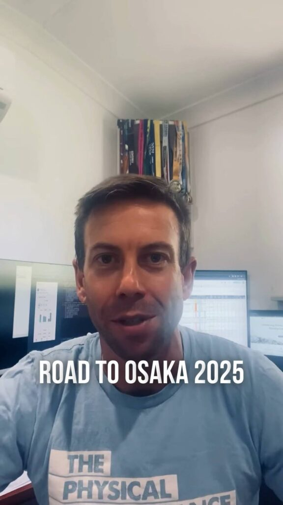

**Chiron Connected Apps (Strava) feature and first summer marathon workout**

This week, I introduced Chiron’s new **Connected Apps** feature! Now you can sync your Strava account to automatically fetch activities and match them with planned workouts. Future integrations with Garmin and Apple Watch are in the works.

Training-wise, I logged 112km over seven runs, two gym sessions, and capped it off with my first tester marathon workout on Sunday.

Check out the full recap and video highlights on Instagram: [@clivegross1](https://www.instagram.com/clivegross1/saved/road-to-osaka-2025/17967922253825997/)

_Week 2 of 18. Osaka Marathon 24 February 2025._
