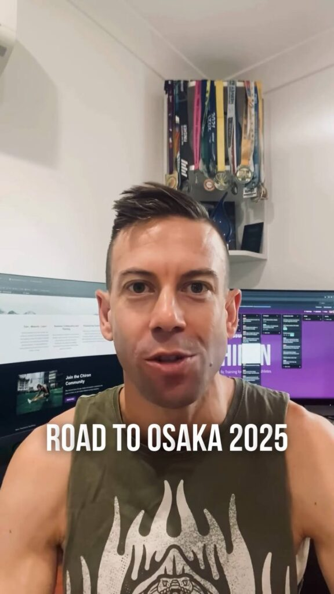
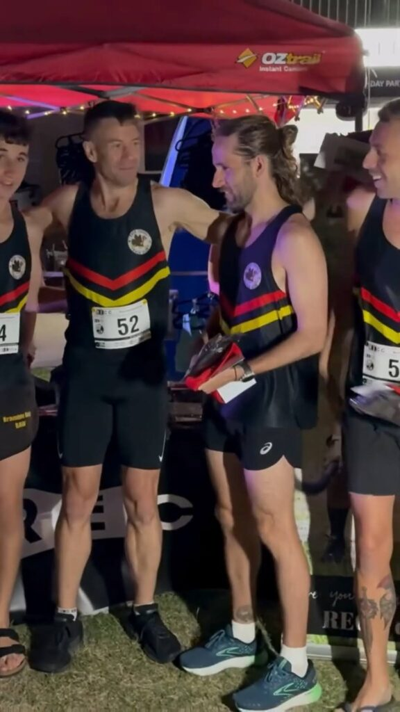

**Chiron coaching feature and RECC Run the World Relay Gold Coast**

This week, I’m excited to showcase Chiron’s new **Coaching feature**, making it easier for coaches to manage and track their athletes' training!

Training highlights include a fun 5 x 600m track session combined with Bush Turkey Track Club and Moreton Bay Road Runners, and a fantastic win at the **RECC Run the World Relay** where our men’s and women's team took first place!

Finished the week with a 2h 10min long run, wrapping up 89km.

Check out the reel on my Instagram: [@clivegross1](https://www.instagram.com/clivegross1/saved/road-to-osaka-2025/17967922253825997/)

_Week 4 of 18. Osaka Marathon 24 February 2025._
