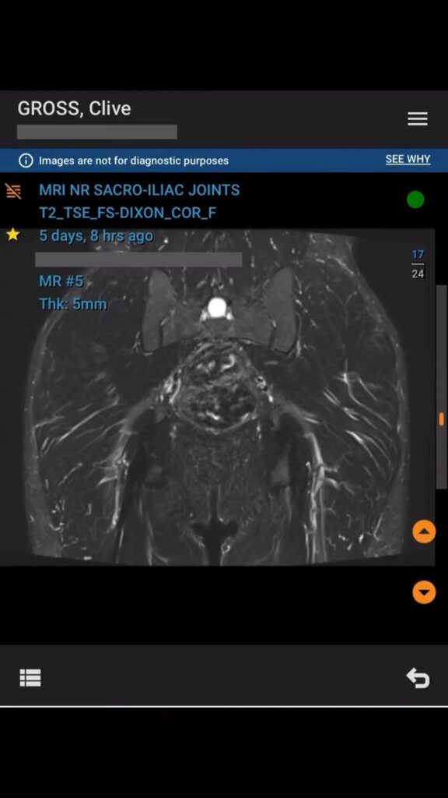

**Chiron Events feature and overtraining injury scare**

Week 5 has been a tough one. I’ve been dealing with what feels like another sacral stress fracture, a familiar challenge for me. Thankfully, the MRI showed no bone stress injury, but I’m still closely monitoring my recovery and adjusting my training plan to stay on track for the marathon.

On the positive side, I’m excited to introduce **Chiron’s new Events feature**, which allows athletes and coaches to create personalized event-based training plans. Whether it’s for a marathon, local race, or fitness milestone, this feature helps set clear targets and structured plans for success.

Check out the reel on my Instagram: [@clivegross1](https://www.instagram.com/clivegross1/saved/road-to-osaka-2025/17967922253825997/)

_Week 5 of 18. Osaka Marathon 24 February 2025._
