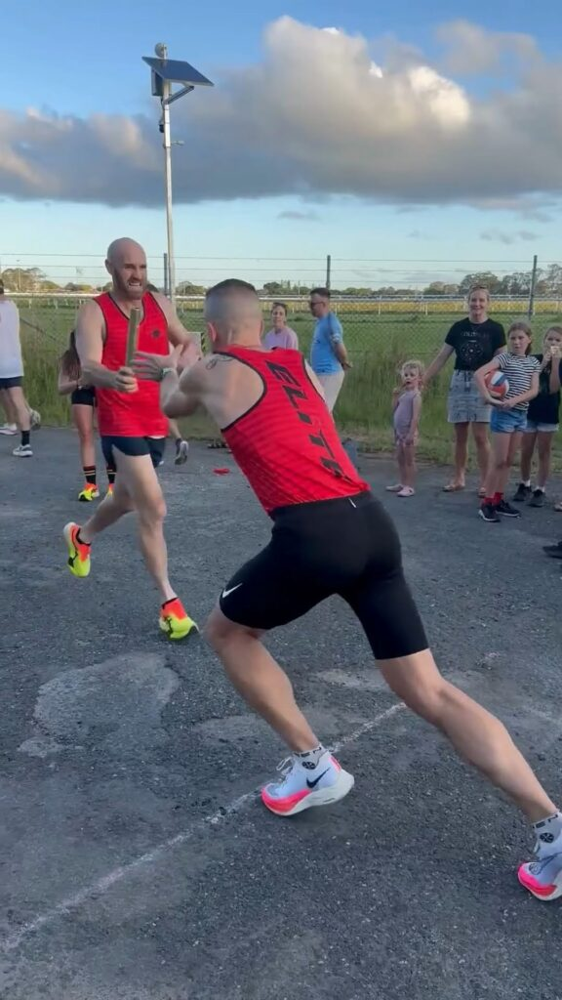

**Chiron merge/unmerge workouts feature, relays, recovery, and progress**

Week 7 of my Road to Osaka 2025 series was all about balance—some fun, some solid training, and a little chaos. The highlight? Friday’s Bush Turkey Relay, where my Red Team put in a strong effort to defend our title. It’s always a blast running this event with mates, and congratulations to the White Team for taking the win this year!

On the Chiron front, I showcased the app’s workout merging feature—a game-changer for keeping training logs clean on busy days.

Total mileage for the week: 105km.

Check out the full recap and race highlights in this week’s episode on Instagram: [@clivegross1](https://www.instagram.com/clivegross1/saved/road-to-osaka-2025/17967922253825997/)

_Week 7 of 18. Osaka Marathon 24 February 2025._
