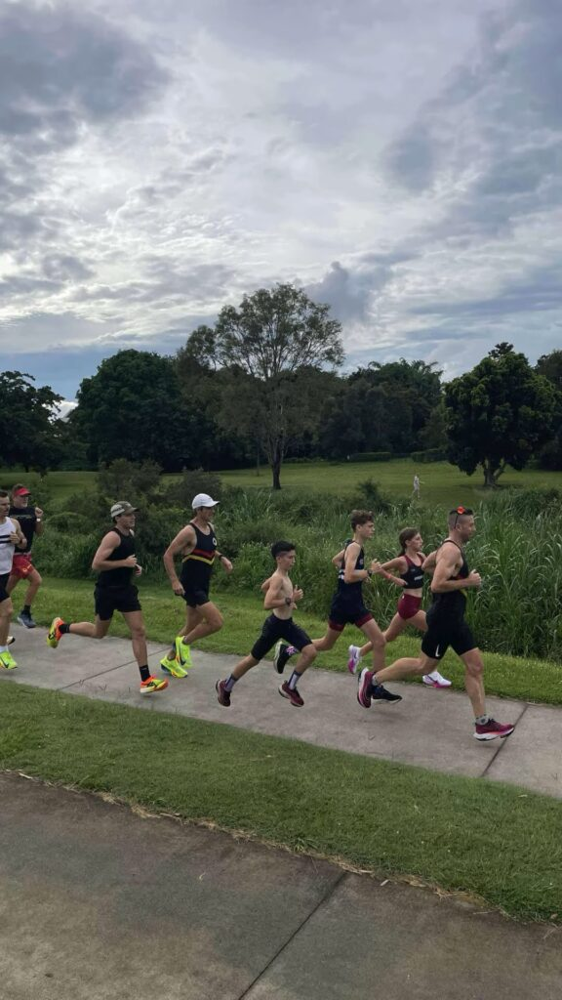

**Local Legends, Kedron pacing, and finding balance**

_Week 8 of my Road to Osaka 2025 series was a balancing act between marathon training, holiday events, and life’s demands. Despite the fatigue creeping in, there were two highlights this week that made it memorable._

This week [I joined Oli Jones and Kyle Weise on the _Local Legends in Running_ podcast](/2024/12/local-legends-in-running-podcast-s3-ep-69-road-to-osaka-gross-weise/), where we shared our journeys to Osaka Marathon. It was a fantastic discussion about marathon prep, balancing training with life, and strategies for race day. If you haven’t already, I recommend giving it a listen!

Second, Saturday at Kedron parkrun was a special one. I had the privilege of pacing my mate Jim Hutchison and others from Bush Turkey Track Club in their sub-17-minute 5km attempt. While conditions weren’t ideal and the goal eluded us, it was great to see their grit, with Jassi earning a new PB. Moments like these remind me why I love being part of the running community.

Total mileage for the week: 109km.

Catch the full recap in this week’s episode on Instagram: [@clivegross1](https://www.instagram.com/clivegross1/saved/road-to-osaka-2025/17967922253825997/)

_Week 8 of 18. Osaka Marathon 24 February 2025._
