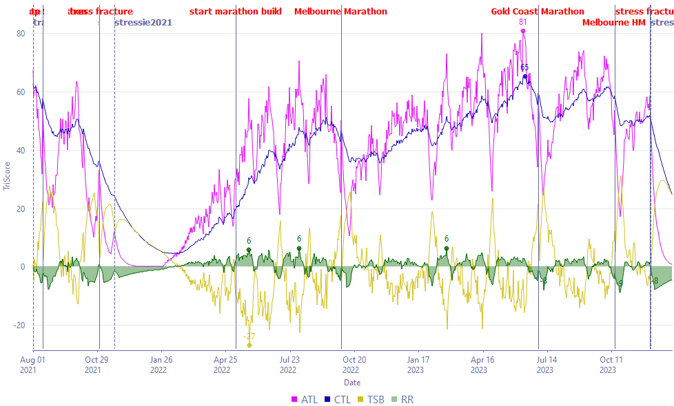

> _“Fitness improves sustainably when loading is balanced with adequate recovery.”_

<figure>

<figcaption>

_Aidan Dineen, On Running SquadRace Relay Gold Coast 2023. Photo by [Paul Manning](https://www.instagram.com/thesundaylongrun/) 2023._

</figcaption>

</figure>

Long distance running requires a balanced training load to ensure best performance while minimising the negative consequences of training (e.g. burnout or injury). Often this isn't as easy as it sounds, I've been sidelined more than once due to injury and am still learning how to get it right.

<!--more-->

Many athletes hire a coach to optimize this training load, as coaches bring expertise in tuning the balance between pushing limits and allowing for necessary recovery, preventing overtraining, and ensuring that each session contributes effectively to overall fitness. Whether the goal is to win a world major, achieve a personal best, or complete a first marathon, the road to success is followed by doing the right amount of training. Figuring out that right amount can be simplified by understanding and measuring training load.

**Stay updated on Chiron's journey to release and be the first to know about new training articles like this - [Sign up here](/contact/).**

**Training fundamentals**

Exercise training can be defined as a systematic process of preparing for a physical goal ([General Principles of Training](https://www.researchgate.net/publication/227991596_General_Principles_of_Training)). Magill et al. capture it well in [Build Your Running Body](https://www.amazon.com.au/Build-Your-Running-Body-Ultramarathoners/dp/161519102X): a runner’s body functions as a team of interdependent systems—brain, muscles, connective tissues, cardiovascular system, mitochondria, nervous system, and more. “Each of these components contributes to every stride you take.” Every cell in the body can adapt to stress, but for meaningful adaptations, a runner must regularly be exposed to an overload stimulus. Increasing levels of loading will lead to progressive adaptation and supercompensation, leading to higher levels of fitness.

The importance of balancing loading with recovery

Initially, the body responds to these stresses with tissue strain and fatigue, but once the loading stops, recovery and adaptation can begin. Likewise when the completely loading stops or is reduced, muscles will atrophy and the cellular adaptations, like increased capillary density, will reverse (reversibility).

<figure>

<figcaption>

_Theory of supercompensation._

</figcaption>

</figure>

When the body is subjected to too much loading or insufficient recovery, it can lead to overtraining, which may result in fatigue, decreased performance, and an increased risk of injury. Conversely, undertraining occurs when the training load is insufficient or there are excessive periods of rest, preventing the body from adapting and improving. Striking the right balance between is crucial for optimal fitness gains!

<figure>

<figcaption>

_Adequate training, training too hard and training too easy_.

</figcaption>

</figure>

Fitness improves sustainably when loading is balanced with adequate recovery.

<figure>

<figcaption>

_Sustainably training to increase athletic performance._

</figcaption>

</figure>

**What is training load?**

Training load, or training stress, is essentially the cumulative work done by an athlete over time. Three elements define it:

1. **Intensity:** The intensity or quality of a workout (e.g., relative pace, heart rate or power output during a session).

2. **Duration:** The length of time spent on each workout.

3. **Frequency:** How often the workouts occur within a given period (weekly, monthly).

Applied sports scientist [Dr Tim Gabbett reports](https://gabbettperformance.com.au/wp-content/uploads/2014/01/the-development-and-application-of-an-injury.pdf) that several studies have investigated the influence of training volume, intensity, and frequency on athletic performance, with performance generally improving with increases in any of these variables. Gabbett's 2010 paper reviews a 1996 study by Foster et al. where 56 runners, cyclists, and speed skaters were studied during 12 weeks of training and reported that a 10-fold increase in training load was associated with a 10% improvement in performance. However, it has also been shown that negative adaptations to exercise training are dose related, with the highest incidence of illness and injury occurring when training loads are highest.

Combining these variables in a balanced way is essential for maximizing adaptation and performance while preventing overtraining.

A word on specificity

Note that this article discusses training load in general terms but not all types of loading will have the same affect on athletic performance. For example, 400s on the athletics track will have a different training affect to a long run on a mountain trail, even if the overall loading is similar.

_(Be sure to [subscribe](/contact/) so you don't miss our upcoming training articles on specificity and how to get the most bang for buck from your training.)_

**Measuring training load**

Back in the 1970s, Dr. Eric Bannister et al. proposed a statistical model to describe an athlete’s response to a given training stimulus. According to this model, the performance of an athlete in response to training can be estimated from the difference between a negative function (fatigue or short term training stress) and a positive function (fitness or long term training stress).

Nowadays, there are many approaches to quantify loading, many of which are built from the foundations of Bannister's models, each with strengths that can guide coaches and athletes in understanding and managing training and recovery. Four established methods are outlined below.

**TRIMP (Training Impulse)**

<figure>

<figcaption>

_Modeling the authors TRIMP training load using Golden Cheetah open source software over several seasons and injuries_

</figcaption>

</figure>

TRIMP, developed by Bannister in the 1970s, uses heart rate to assess the load of a workout. The idea is to calculate the "impulse" generated by a session and apply a factor based on heart rate to reflect the intensity of effort. This model multiplies the workout duration by intensity and assigns higher weights to periods of elevated heart rate, representing the physiological demands of more intense efforts.

- **Strengths:** Simple and effective, especially for steady-state runs.

- **Limitations:** May be less suitable for interval-based sessions, running over hilly terrain or for capturing the full biomechanical impact of running.

**TSS (Training Stress Score)**

Initially created by Dr. Andrew Coggan in the early 2000s for cycling, [TSS calculates training load](https://www.trainingpeaks.com/learn/articles/normalized-power-intensity-factor-training-stress/) by factoring in workout duration and intensity relative to an athlete's Functional Threshold Power (FTP) but can also be applied to running pace or heart rate relative to functional threshold pace or HR. This model is especially effective for athletes working with power data.

- **Strengths:** When used with power, tied directly to work output. Accurately reflects different energy system demands.

- **Limitations:** Originally designed for cycling, so it may not capture mechanical stress in the same way for runners. Requires equipment such as a GPS watch, power meter and specialised software, which may not be accessible to all runners.

**GOVSS (Gravity Ordered Velocity Stress Score)**

<figure>

<figcaption>

_Modeling the authors GOVSS training load using Golden Cheetah open source software over several seasons and injuries_

</figcaption>

</figure>

Dr. Phil Skiba published [the development of the GOVSS algorithm](https://runscribe.com/wp-content/uploads/power/GOVSS.pdf) in 2006 to address running-specific factors, such as pace, terrain, and elevation. By adjusting for grade, it provides a more realistic view of the physiological load, making it well-suited for runners who train in varied environments.

- **Strengths:** Similar to Coggan's TSS but ideal for runners, especially for interval, hill or trail training. Relative mechanical power output is modelled without the need for a power meter.

- **Limitations:** Requires equipment such as a GPS watch and specialised software, which may not be accessible to all runners.

**sRPE (Session Rating of Perceived Exertion)**

Outlined in [Tim Gabbett's research](https://gabbettperformance.com.au/wp-content/uploads/2014/01/the-development-and-application-of-an-injury.pdf), this approach uses a modified Rating of Perceived Exertion (RPE) scale to estimate the intensity of each session. Athletes assess how hard the workout felt 30 minutes after completing it, rating it on a scale of perceived effort. Training load is then calculated by multiplying the session's intensity rating by its duration, giving a load score in arbitrary units (AU). Gabbett reports that research has shown that sRPE correlates well with objective measures like heart rate and blood lactate concentration, making it a reliable, accessible method for quantifying training intensity across various types of exercise.

- **Strengths:** Simple and cost-effective, as it doesn’t require specialized equipment. Offers a practical, athlete-centered measure of training intensity, with good correlations to heart rate and blood lactate concentration.

- **Limitations:** Subjective by nature, as it relies on an athlete's self-assessment, which can vary depending on mood, environment, and individual pain tolerance. It may be less precise for very short or high-intensity interval sessions where perception can be influenced by acute fatigue.

## **Your training tools**

While tools like TRIMP, TSS, GOVSS, and sRPE offer valuable insights, no single metric can fully account for the complex interplay of factors affecting fitness and fatigue. Metrics provide useful data points, but they often rely on assumptions and can miss the nuances of individual responses to training. Incorporating subjective measures—such as self-reported well-being or perceived exertion—alongside objective metrics allows athletes and coaches to create a more holistic understanding of injury risk and performance outcomes.

<figure>

<figcaption>

_Wondai Country Running Festival 2024 Parkside 10km women's podium_

</figcaption>

</figure>

**Chiron: a case for intelligent training load management**

At Chiron, our mission is to bridge the gap between the art and science of training. Combining athlete historical data, established training load models, user-reported subjective inputs, and machine intelligence that adapts to the individual, we have an ambitious goal to deliver unparalleled precision and insight. By integrating intelligent training load management into our platform, we aim to empower coaches and athletes to achieve their own ambitious goals.

<figure>

<figcaption>

_RECC Run The World Relay Gold Coast 2024. Photo by [Paul Manning](https://www.instagram.com/thesundaylongrun/) 2024._

</figcaption>

</figure>

On the horizon, Chiron will unveil advanced performance and training load management features designed to support coaches and athletes with planning and execution. Readers can [subscribe here](/contact/) to stay informed about the latest advancements. Here’s a glimpse into our roadmap and how Chiron can help you achieve your own ambitious goals:

1. 🧮 **Track training load**: Chiron measures current and historical training load, peak performances, and other athlete data.

2. 🎯 **Set goals and constraints**: Coaches and athletes can define event goals, performance targets, and training constraints (e.g., designated rest days, club sessions, tapering strategies).

3. 🛠️ **Build a training plan**: The AI-powered Assistant Coach works with coaches to generate optimal target training load curves, incorporating progressive overload, recovery periods, and athlete-specific factors.

4. ✏️ **Customize**: Coaches and athletes tailor the plan, ensuring each cycle aligns with target training loads and upcoming events. Assistant Coach offers recommendations based on historical data and predefined constraints.

5. 🔄 **Execute and adapt**: Athletes follow the plan while providing periodic subjective inputs such as fatigue, RPE, sickness or niggles. Assistant Coach uses machine intelligence to continually provide insights and adapt to the individual. Plans are regularly fine-tuned by the coach, athlete or Assistant Coach to reflect progress and insights.

6. 🏁 **Race day and beyond**: After the race, athletes and coaches reflect on performance and use the learnings to shape future training cycles. These insights feed back into Assistant Coach, improving precision and personalization for subsequent cycles.

## **Finding the balance**

Whether training solo or with the guidance of a coach, understanding and managing training load is essential for any long-distance runner striving for consistent, injury-free progress. No single tool or metric tells the whole story, but with a balanced approach combining objective data and subjective insights, athletes can unlock their full potential. In the near future, Chiron’s intelligent performance and training load management system promises to deliver greater precision and insight, empowering runners and coaches to achieve their performance goals. Stay connected and [subscribe to be informed](/contact/) about the latest advancements in Chiron!
