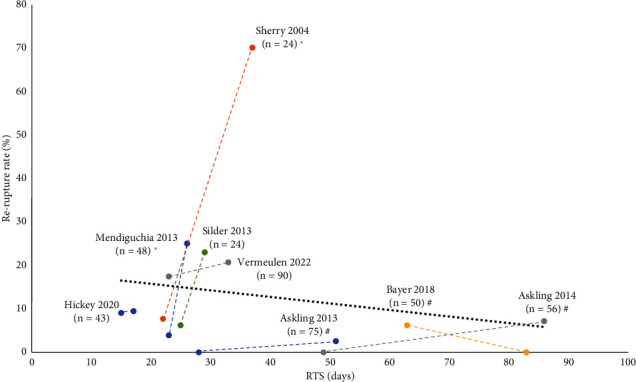

Tim Gabbett recently wrote a [great article on the lessons strength and conditioning coaches can learn from rehab professionals \[1\]](https://gabbettperformance.com.au/you-cant-cheat-biological-healing-time-what-can-strength-and-conditioning-coaches-learn-from-rehab-professionals/) — particularly the reminder that _you can’t cheat biological healing time_. It got me thinking about how this principle plays out in the real world for athletes returning from injury, and how the idea of _appropriate loading_ is often misunderstood.

<figure>

<figcaption>

A Chiron users weekly training volume progression as they return to run following a bone stress injury. Note the tissue loading through strength training and cross training commences well before running activities.

</figcaption>

</figure>

Physiotherapists and other sports health professionals have understood this for decades — which is why they’re always nagging us to do those boring rehab exercises that feel like they aren’t doing much. They know that gradual, progressive loading is essential for restoring tissue capacity, and that skipping this process can set you up for setbacks — whether through direct re-injury, or by deloading other tissue and leaving it less resilient, triggering a chain reaction of problems.

Outside of clear exceptions — like the initial weeks of a bone injury — _some loading is almost always better than no loading_ when returning from an injury. This isn’t about pushing through reckless amounts of pain, but about maintaining tissue capacity and preventing the sharp drop in strength, coordination, and resilience that can come from total rest.

<figure>

<figcaption>

Photo by [Julia Rekamie](https://unsplash.com/@juliarekamie?utm_content=creditCopyText&utm_medium=referral&utm_source=unsplash) on [Unsplash](https://unsplash.com/photos/woman-in-red-leggings-and-white-sports-bra-bending-her-body-2aHSA17X17c?utm_content=creditCopyText&utm_medium=referral&utm_source=unsplash)

</figcaption>

</figure>

I’ve experienced this first-hand with a long-standing proximal hamstring tendinopathy. Over the years, its symptoms have ranged from vague to non-existent, to tight and sore, to feeling on the verge of rupturing. But here’s the thing — it’s never actually stopped me from training or racing. I suspect that regular running, combined with consistent strength work like Romanian Deadlifts, has provided a protective effect by keeping the tendon under load. Stopping completely might have reduced symptoms temporarily, but it would likely have left the tendon less resilient and more prone to flare-ups.

A [recent scientific review by Wulff et al \[2\]](https://pmc.ncbi.nlm.nih.gov/articles/PMC11390226/) on tendon loading and adaptation reinforces this. Key takeaways include:

- **Tendons respond best to progressive mechanical loading.** Well-structured strength and plyometric work can improve tendon stiffness and load tolerance.

- **Complete rest rarely resolves tendinopathy** and can reduce tissue capacity, making re-injury more likely.

- **Pain during loading isn’t always harmful**, provided it’s within acceptable limits and monitored over time.

- **Sport-specific loading patterns matter.** Exercises that mimic the demands of your sport are more likely to produce meaningful, long-term adaptations.

<figure>

<figcaption>

The relationship between days to return to sport (RTS) and the risk of subsequent reruptures. Each study is marked with two data points representing each rehabilitation group with the time until RTS on the x-axis and the rerupture rate (in %) in the y-axis. The two points representing two intervention groups are connected by a dotted line for clarity. n indicates the total number of participants in each study, and the trend line (mean of the two rehabilitation groups for each study) is indicated by a black dotted line.  ∗ Significant difference between intervention groups regarding RTS. # Significant difference between intervention groups regarding rerupture rate \[2\]. Reused with permission under the Creative Commons Attribution 4.0 International License (CC BY 4.0).

</figcaption>

</figure>

When you combine these findings with Gabbett’s reminder about respecting biological time, a clear message emerges: you can’t rush healing, but you can — and should — keep applying the right kind of load. For athletes and coaches, this means:

1. Accept that tissues will heal at their own rate — pushing harder doesn’t make biology go faster.

2. Avoid complete rest unless medically necessary.

3. Use progressive, sport-specific loading to bridge the gap between rehab and full performance.

Recovery has its own timeframe, but you can guide it wisely with the right loading. Be sure to consult with your sports physiotherapist, coach, or sports medicine professional to find the right balance between recovery, resilience, and performance.

## References

\[1\] Gabbett TJ. You can’t cheat biological healing time – what can strength and conditioning coaches learn from rehab professionals? \[Internet\]. Brisbane (QLD): Gabbett Performance Solutions; 2023 Sep 25 \[cited 2025 Aug 13\]. Available from: [https://gabbettperformance.com.au/you-cant-cheat-biological-healing-time-what-can-strength-and-conditioning-coaches-learn-from-rehab-professionals/](https://gabbettperformance.com.au/you-cant-cheat-biological-healing-time-what-can-strength-and-conditioning-coaches-learn-from-rehab-professionals/)

[\[2\] Wulff MW, Mackey AL, Kjær M, Bayer ML. Return to Sport, Reinjury Rate, and Tissue Changes after Muscle Strain Injury: A Narrative Review. Transl Sports Med. 2024 Sep 4;2024:2336376. doi: 10.1155/2024/2336376. PMID: 39263259; PMCID: PMC11390226.](https://pmc.ncbi.nlm.nih.gov/articles/PMC11390226/)
